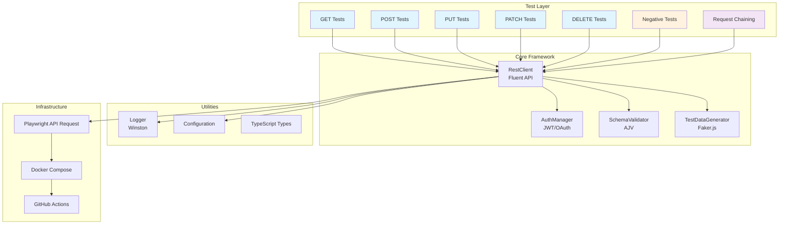

# Playwright API Automation Framework

[](https://github.com/yourusername/playwright-api-automation-framework/actions)
[](https://opensource.org/licenses/MIT)
[](https://nodejs.org/)
[](https://www.typescriptlang.org/)
[](https://playwright.dev/)

An enterprise-grade, production-ready API automation framework built with **Playwright**, **TypeScript**, and modern testing best practices. Designed for comprehensive REST API testing with support for authentication, schema validation, data generation, and parallel execution.

## Table of Contents

- [Features](#features)
- [Architecture](#architecture)
- [Tech Stack](#tech-stack)
- [Installation](#installation)
- [Configuration](#configuration)
- [Project Structure](#project-structure)
- [Usage](#usage)
- [Testing Standards](#testing-standards)
- [CI/CD](#cicd)
- [Docker Support](#docker-support)
- [Contributing](#contributing)
- [License](#license)

## Features

✅ **REST API Testing** - Complete CRUD operations (GET, POST, PUT, PATCH, DELETE)  
✅ **Request Chaining** - Complex multi-step workflows  
✅ **Schema Validation** - JSON Schema validation with AJV  
✅ **Authentication** - JWT and OAuth token management  
✅ **Test Data Generation** - Faker.js integration for realistic test data  
✅ **Parallel Execution** - Run tests concurrently with configurable workers  
✅ **Retry Logic** - Automatic retry for flaky tests  
✅ **Logging** - Comprehensive logging with Winston  
✅ **Screenshots & Videos** - Capture failures for debugging  
✅ **Trace Viewer** - Playwright trace files for test analysis  
✅ **Cross-Browser** - Support for multiple browsers  
✅ **CI/CD Ready** - GitHub Actions workflow included  
✅ **Docker Support** - Containerized test execution  
✅ **Type Safety** - Strict TypeScript with 100% type coverage  
✅ **Code Quality** - ESLint and Prettier configuration  

## Architecture



## Tech Stack

| Component | Technology | Version |
|-----------|-----------|---------|
| **Language** | TypeScript | 5.3.3 |
| **Test Framework** | Playwright | 1.43.1 |
| **Data Generation** | Faker.js | 8.4.1 |
| **Schema Validation** | AJV | 8.12.0 |
| **Logging** | Winston | 3.11.0 |
| **Code Quality** | ESLint | 8.56.0 |
| **Formatting** | Prettier | 3.2.5 |
| **Container** | Docker | Latest |
| **CI/CD** | GitHub Actions | Latest |

## Installation

### Prerequisites

- **Node.js**: >= 18.0.0
- **npm**: >= 9.0.0
- **Docker**: (optional, for containerized execution)
- **Git**: (for version control)

### Step 1: Clone Repository

```bash
git clone https://github.com/yourusername/playwright-api-automation-framework.git
cd playwright-api-automation-framework
```

### Step 2: Install Dependencies

```bash
npm install
```

### Step 3: Setup Environment

```bash
cp .env.example .env
```

Edit `.env` with your configuration:

```env
API_BASE_URL=https://jsonplaceholder.typicode.com
LOG_LEVEL=info
TEST_TIMEOUT=30000
RETRY_COUNT=2
```

### Step 4: Build TypeScript

```bash
npm run build
```

## Configuration

### Environment Variables

| Variable | Description | Default |
|----------|-------------|---------|
| `API_BASE_URL` | Base URL for API under test | `https://jsonplaceholder.typicode.com` |
| `LOG_LEVEL` | Logging level (debug, info, warn, error) | `info` |
| `TEST_TIMEOUT` | Test timeout in milliseconds | `30000` |
| `RETRY_COUNT` | Number of retries for failed tests | `2` |
| `OAUTH_CLIENT_ID` | OAuth client ID (if applicable) | - |
| `OAUTH_CLIENT_SECRET` | OAuth client secret (if applicable) | - |
| `OAUTH_TOKEN_URL` | OAuth token endpoint (if applicable) | - |

### Playwright Configuration

Edit `playwright.config.ts` to customize:

- **Workers**: Parallel test execution count
- **Retries**: Automatic retry strategy
- **Timeout**: Request and test timeouts
- **Reporters**: HTML, JSON, JUnit reports
- **Trace**: Test trace capture strategy

## Project Structure

```
📦 playwright-api-automation-framework
├── 📂 src/
│   ├── 📂 utils/              # Reusable utilities
│   │   ├── rest-client.ts     # Fluent REST API client
│   │   ├── auth.ts            # JWT/OAuth authentication
│   │   ├── schema-validator.ts # JSON schema validation
│   │   ├── test-data-generator.ts # Faker.js data generation
│   │   └── logger.ts          # Winston logging setup
│   ├── 📂 config/             # Configuration
│   │   └── api-config.ts      # API endpoints and config
│   └── 📂 types/              # TypeScript types
│       └── api.types.ts       # Shared type definitions
│
├── 📂 tests/
│   ├── 📂 specs/              # Test specifications
│   │   ├── get.spec.ts        # GET endpoint tests
│   │   ├── post.spec.ts       # POST endpoint tests
│   │   ├── put.spec.ts        # PUT endpoint tests
│   │   ├── patch.spec.ts      # PATCH endpoint tests
│   │   ├── delete.spec.ts     # DELETE endpoint tests
│   │   ├── negative.spec.ts   # Negative & edge case tests
│   │   └── chaining.spec.ts   # Request chaining workflow tests
│   ├── 📂 fixtures/           # Test fixtures and mock data
│   │   └── test-data.ts       # Mock data for tests
│   ├── global-setup.ts        # Global test setup
│   └── global-teardown.ts     # Global test teardown
│
├── 📂 .github/
│   ├── 📂 workflows/
│   │   └── tests.yml          # GitHub Actions CI/CD workflow
│   ├── ISSUE_TEMPLATE/        # Issue templates
│   └── PULL_REQUEST_TEMPLATE/ # PR template
│
├── 📂 results/                # Test results (generated)
│   ├── html-report/           # HTML report
│   ├── results.json           # JSON results
│   └── junit.xml              # JUnit XML report
│
├── .eslintrc.json             # ESLint configuration
├── .prettierrc.json           # Prettier configuration
├── .gitignore                 # Git ignore rules
├── .env.example               # Environment variables template
├── playwright.config.ts       # Playwright configuration
├── tsconfig.json              # TypeScript configuration
├── package.json               # Project dependencies
├── Dockerfile                 # Docker image definition
├── docker-compose.yml         # Docker compose orchestration
├── README.md                  # This file
├── CHANGELOG.md               # Version history
├── CONTRIBUTING.md            # Contributing guidelines
└── LICENSE                    # MIT License
```

## Usage

### Run All Tests

```bash
npm test
```

### Run Smoke Tests Only

```bash
npm run test:smoke
```

### Run Regression Tests Only

```bash
npm run test:regression
```

### Run Tests in Parallel (4 workers)

```bash
npm run test:parallel
```

### Run Tests Serially

```bash
npm run test:serial
```

### Debug Tests with UI

```bash
npm run test:ui
```

### Debug Single Test

```bash
npm run test:debug -- tests/specs/get.spec.ts
```

### View HTML Report

```bash
npm run test:report
```

### View Trace Files

```bash
npm run test:trace
```

## Testing Standards

### Test Tags

Tests are tagged for selective execution:

- `@smoke` - Quick smoke tests for core functionality
- `@regression` - Full regression test suite

### Test Assertions

```typescript
// Status code validation
expect(response.status).toBe(200);

// Response body validation
expect(response.body).toHaveProperty('id');

// Schema validation
expect(schemaValidator.validate(schema, response.body).isValid).toBe(true);

// Property value assertion
expect(response.body.title).toBe('Expected Title');
```

### Test Data

Generated using Faker.js with fixtures:

```typescript
// Generate single user
const user = testDataGenerator.generateUser();

// Generate multiple posts
const posts = testDataGenerator.generatePosts(5);

// With overrides
const post = testDataGenerator.generatePost({ userId: 1 });
```

### Request Chaining

Complex workflows combining multiple requests:

```typescript
// Create post, update it, verify, delete
const createResponse = await restClient.given().body(payload).post(endpoints.posts);
const postId = createResponse.body.id;

await restClient.get(endpoints.postById(postId));
await restClient.given().body(updated).put(endpoints.postById(postId));
await restClient.delete(endpoints.postById(postId));
```

## CI/CD

### GitHub Actions Workflow

The project includes an automated CI/CD pipeline (`.github/workflows/tests.yml`) that:

1. Runs on every push to `main` and `develop` branches
2. Executes on pull requests to `main` and `develop`
3. Runs daily scheduled tests (2 AM UTC)
4. Tests against Node.js 18.x and 20.x
5. Uploads test artifacts and trace files
6. Validates code quality (linting, formatting, type checking)

### Local CI Simulation

```bash
npm run type-check
npm run lint
npm run format:check
npm test
```

## Docker Support

### Build Docker Image

```bash
docker build -t playwright-api-tests:latest .
```

### Run Tests in Docker

```bash
docker-compose up --abort-on-container-exit
```

### Environment Variables in Docker

```bash
docker run -e API_BASE_URL=https://api.example.com playwright-api-tests:latest
```

## Code Quality

### TypeScript Type Checking

```bash
npm run type-check
```

### Linting

```bash
npm run lint           # Check for linting errors
npm run lint:fix       # Fix linting errors automatically
```

### Formatting

```bash
npm run format         # Format code with Prettier
npm run format:check   # Check formatting without changes
```

### Build

```bash
npm run build          # Compile TypeScript to JavaScript
npm run clean          # Remove dist and results directories
```

## Test Execution Examples

### Example 1: Single GET Test

```bash
npx playwright test tests/specs/get.spec.ts -g "GET /users"
```

### Example 2: All POST Tests with Debug

```bash
npm run test:debug -- tests/specs/post.spec.ts
```

### Example 3: Smoke Tests with Trace

```bash
npm run test:smoke -- --trace on
```

## Troubleshooting

### Issue: Tests timeout

**Solution**: Increase `timeout` in `playwright.config.ts` or set `TEST_TIMEOUT` env variable

```bash
TEST_TIMEOUT=60000 npm test
```

### Issue: API endpoint unreachable

**Solution**: Verify `API_BASE_URL` is correct and accessible

```bash
curl https://jsonplaceholder.typicode.com/posts/1
```

### Issue: Port conflicts in Docker

**Solution**: Map to different port in `docker-compose.yml`

```yaml
ports:
  - "3001:3000"
```

### Issue: ESLint strict mode failures

**Solution**: Fix linting errors or update ESLint rules in `.eslintrc.json`

```bash
npm run lint:fix
```

## Performance Optimization

### Parallel Execution

Configure workers in `playwright.config.ts`:

```typescript
workers: process.env.CI ? 1 : 4, // 4 workers locally, 1 in CI
```

### Retry Strategy

```typescript
retries: process.env.CI ? 2 : 0, // Retry only in CI
```

### Request Timeout

```typescript
use: {
  timeout: 10000, // 10 seconds per request
}
```

## Best Practices

✅ Always validate response schema before assertions  
✅ Use meaningful test descriptions with tags (@smoke, @regression)  
✅ Leverage request chaining for complex workflows  
✅ Generate realistic test data with Faker.js  
✅ Implement comprehensive logging for debugging  
✅ Keep utilities and tests separated for reusability  
✅ Use TypeScript strict mode for type safety  
✅ Document all API endpoints in config  
✅ Maintain fixture data in separate files  
✅ Run linting and formatting before commits  

## Contributing

See [CONTRIBUTING.md](CONTRIBUTING.md) for detailed guidelines on:

- Development setup
- Code standards
- Commit conventions
- Pull request process
- Testing requirements

## License

This project is licensed under the MIT License. See [LICENSE](LICENSE) file for details.

## Support

For issues, questions, or contributions:

- 📝 [Create an Issue](https://github.com/yourusername/playwright-api-automation-framework/issues)
- 📢 [Start a Discussion](https://github.com/yourusername/playwright-api-automation-framework/discussions)
- 🔀 [Submit a Pull Request](https://github.com/yourusername/playwright-api-automation-framework/pulls)

## Changelog

See [CHANGELOG.md](CHANGELOG.md) for version history and release notes.

---

**Built with ❤️ by SDET Team | Enterprise-Grade API Automation Framework**
